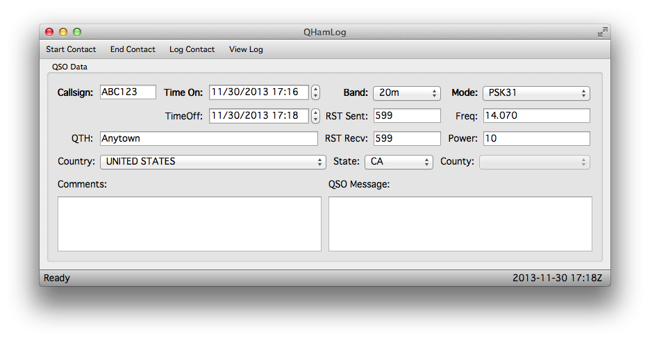

# QHamLog

_Simple, cross-platform, ADIF-compliant Amateur Radio QSO logging application_

After spending a while searching for a modern-looking open source Ham Radio contact logging
application, I was dismayed by the lack of choices that fit my requirements. In an effort to fill
this gap I created QHamLog.

**Note**: QHamLog is in very early stages of development, and is very limited on functionality in
its current state. See the Features and TODO sections below for an idea of things that work and
things that need work.

QHamLog implements the Amateur Data Interchange Format (ADIF) version 3.0.4. For more
information on ADIF, see <http://adif.org/304/ADIF_304.htm>.

## Features

- Enter, validate, and log basic QSO information
- View, edit, and delete existing QSO log entries
- Export QSO log to ADIF (.adi format) [v3.0.4](http://adif.org/304/ADIF_304.htm)
- [SQLite](http://www.sqlite.org/) database storage for QSO log and ADIF enumerations
- Modern, simple user interface
- Cross-platform (see the Building section, below)

## Building

QHamLog is based on Qt, and should build and run on Windows, Mac, and Linux. That said...

QHamLog has currently only been built under the following setups:
* Mac OSX 10.9 / Qt Creator 2.8.1 / Qt 5.1.1
* Windows 7 64-bit / Qt Creator 2.8.1 / Qt 5.1.1 (32-bit MinGW)

If you've successfully built under other setups, please let me know!

## TODO

- Add user preferences window and prefs DB
- Improve QSO log field validation
- UX enhancements (popups, icons, keyboard shortcuts, etc.)
- Export log file data to valid ADIF (.adi and .adx formats), multiple versions
- Import log file data from ADIF (.adi and .adx formats), multiple versions
- Select specific records/fields to import/export

Please feel free to file enhancement requests on the Issues page.

## License

Copyright 2013 Alex Gladd

QHamLog is licensed under the GPLv3

This program is free software: you can redistribute it and/or modify
it under the terms of the GNU General Public License as published by
the Free Software Foundation, either version 3 of the License, or
(at your option) any later version.

This program is distributed in the hope that it will be useful,
but WITHOUT ANY WARRANTY; without even the implied warranty of
MERCHANTABILITY or FITNESS FOR A PARTICULAR PURPOSE.  See the
GNU General Public License for more details.

You should have received a copy of the GNU General Public License
along with this program.  If not, see <http://www.gnu.org/licenses/>.
